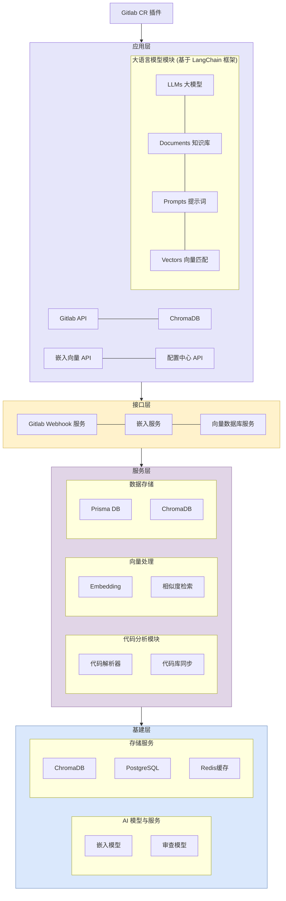
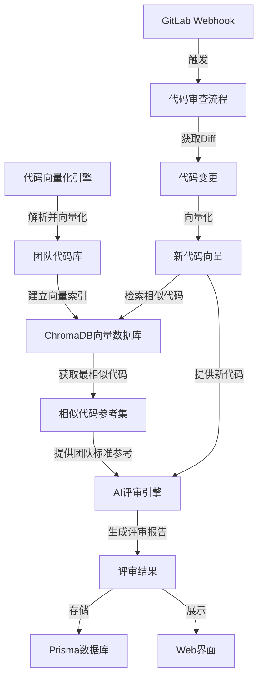
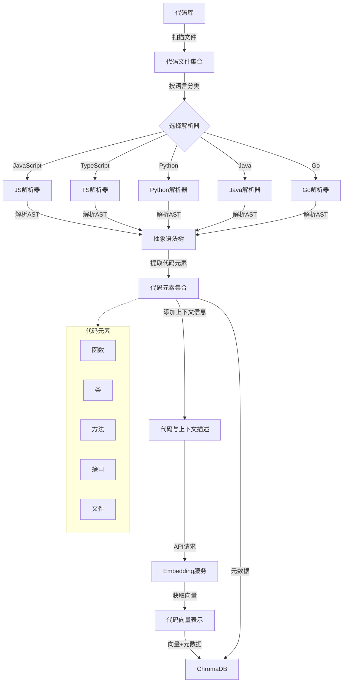
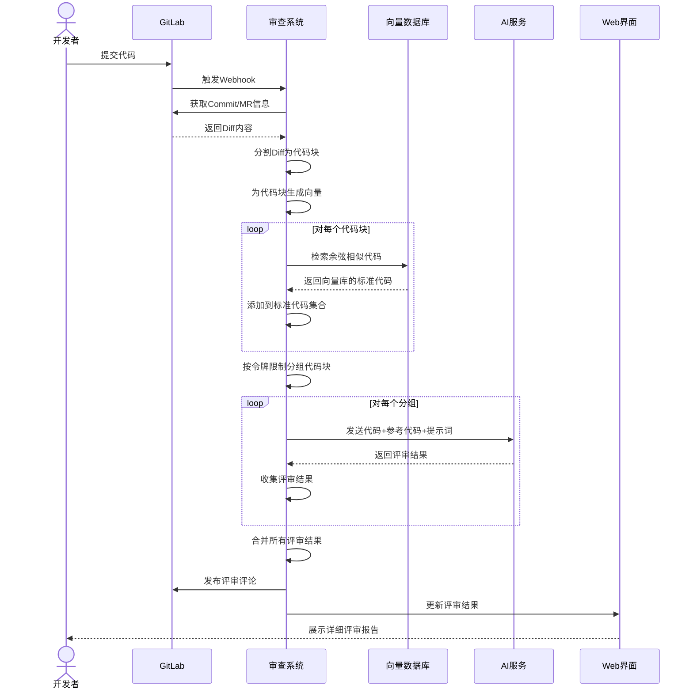

## 一、项目背景与意义

随着团队规模的扩大和代码库的不断积累，保持代码质量和风格一致性变得越来越具有挑战性。开发人员在编写新代码时，需要遵循团队既有的编码规范和最佳实践，但由于团队成员背景和经验的差异，这一目标往往难以实现。

本项目旨在构建一个智能代码审查系统，通过向量化团队已有代码并结合人工智能技术，为新提交的代码提供具有针对性的审查意见，帮助团队成员更好地理解并遵循团队编码标准，提高代码质量，降低维护成本。

## 二、系统架构概述

### 2.1 分层架构



### 2.2 系统流程图



系统主要由三大模块组成：

1. **代码向量化引擎**：解析并向量化团队已有的代码库
2. **相似度检索模块**：为新提交的代码找到团队库中最相似的代码
3. **AI 审查引擎**：结合相似代码，提供具有针对性的代码审查意见

## 三、核心技术流程

### 3.1 代码库向量化



1. **代码解析与提取**
   - 支持多种语言（JavaScript、TypeScript、Python、Java、Go 等）
   - 使用 Tree-sitter 解析器将代码转换为抽象语法树(AST)
   - 提取函数、类、方法等代码元素

2. **向量生成**
   - 为每个代码元素构建包含上下文的描述文本
   - 通过嵌入 API 获取代码的向量表示
   - 处理速率限制和错误重试

3. **向量存储**
   - 使用 ChromaDB 作为向量数据库
   - 为每个项目维护单独的代码向量集合
   - 保存代码元素的元数据（文件路径、代码类型、行号等）

### 3.2 代码审查流程



1. **GitLab Webhook 触发**
   - 开发者提交代码后，GitLab 自动触发 webhook
   - 系统获取 commit 的 diff 信息

2. **代码切片与向量化**
   - 将 diff 内容分割为有意义的代码块
   - 为每个代码块生成向量表示

3. **相似代码检索**
   - 在向量数据库中查询与新代码最相似的已有代码
   - 提取相似代码作为参考标准

4. **分组与令牌计算**
   - 将代码块分组以控制 AI 请求的令牌数
   - 确保每组内容不超过模型上下文限制

5. **AI 评审与意见整合**
   - 发送代码和相似参考代码给 AI 进行评审
   - 按评审维度生成评分和建议
   - 合并多组评审结果，生成完整报告

6. **结果存储与展示**
   - 将评审结果保存到 Prisma 数据库
   - 通过 Web 界面展示评审结果

## 四、系统优势与特色

### 4.1 基于向量相似度的团队标准参考

与传统代码规范文档不同，本系统直接从团队现有代码中学习，提供与当前代码最相关的参考示例。这种方式有以下优势：

- **更具针对性**：根据具体代码提供相似的最佳实践示例
- **自动更新**：随着团队代码的迭代，审查标准自然演进
- **降低学习成本**：开发者可以直观地看到团队编码风格

### 4.2 多维度评分机制

系统从多个维度对代码进行评审：

- **代码质量**：整体结构和组织
- **可读性**：清晰度和易理解性
- **性能**：运行效率和资源利用
- **安全性**：潜在漏洞和安全隐患
- **可维护性**：扩展性和未来可修改性
- **一致性**：与团队现有代码风格的符合度

### 4.3 智能分组与令牌管理

系统会根据代码量和复杂度，自动将代码分组并控制 AI 请求中的令牌数，确保：

- 不超出 AI 模型的上下文限制
- 优化 API 调用成本
- 保持审查质量和完整性

## 五、实施与部署

### 5.1 环境要求

- Node.js 环境
- ChromaDB 向量数据库
- PostgreSQL 关系型数据库（或 SQLite）
- GitLab 实例（用于 Webhook）

### 5.2 快速开始

1. 启动 ChromaDB 服务

   ```bash
   npm run chroma:start
   ```

2. 同步本地代码库

   ```bash
   npm run vector:sync-local <项目ID> [代码库路径]
   ```

3. 配置 GitLab Webhook
   - URL: /api/webhook/gitlab
   - 事件: Push events, Merge request events

4. 启动 Web 应用
   ```bash
   npm run dev
   ```

## 六、未来展望

### 6.1 性能优化

- 实现增量同步，只处理变更的代码文件
- 优化向量检索算法，提高相似度匹配精度
- 使用缓存减少重复计算和 API 调用

### 6.2 功能扩展

- 支持更多编程语言和框架
- 集成到 IDE 插件，提供实时编码建议
- 引入团队自定义规则和评分标准
- 添加历史审查数据分析，生成团队编码质量报告

### 6.3 协作增强

- 支持多人审查协作
- 与项目管理工具集成，跟踪代码质量改进
- 建立团队代码知识库，沉淀编码最佳实践

## 七、结论

基于向量相似度的团队代码审查系统通过结合现代 AI 技术和团队已有代码库，提供了一种智能化、自适应的代码审查解决方案。该系统不仅能帮助开发人员更好地理解和遵循团队编码标准，还能持续积累和沉淀团队的技术知识，为代码质量保障和团队协作提供强有力的支持。

通过向量化团队代码并利用相似度检索技术，系统能够为每一段新提交的代码找到最相关的团队标准参考，使代码审查不再依赖于静态的规范文档，而是动态地适应团队编码实践的演进。这一特性使得系统特别适合快速迭代的开发团队，能够在保持灵活性的同时确保代码质量和一致性。

---

> 🚀 **项目特色**: 这是一个创新性的 AI 代码审查解决方案，通过向量相似度匹配技术，实现了基于团队历史代码的智能审查，为代码质量保障提供了全新的思路和实践方法。
