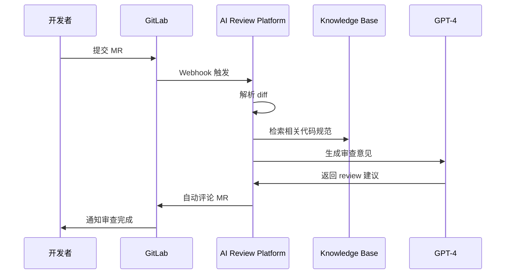

## 项目概述

为了提高代码审查效率和质量，我设计并实现了基于 AI 的智能代码审查平台。该平台通过 GitLab Webhook 自动捕获代码变更，结合知识库中的历史代码和最佳实践，生成高质量的代码审查意见。

## 核心架构

### 技术栈
- **后端**: Nest.js + TypeScript + Express
- **AI 框架**: LangChain + OpenAI GPT-4
- **向量数据库**: Milvus (复用知识库平台)
- **版本控制**: GitLab API + Webhook
- **消息队列**: Bull Queue (Redis)

### 工作流程


## 核心功能

### 🔍 智能代码分析
- **增量 Diff 解析**: 只分析变更的代码片段
- **语法树分析**: AST 解析，理解代码结构和语义
- **复杂度评估**: 圈复杂度、认知复杂度计算
- **安全扫描**: 常见安全漏洞检测

### 🧠 知识库增强
- **历史代码匹配**: 从知识库中找到相似的历史代码
- **最佳实践推荐**: 基于团队代码规范的建议
- **API 一致性检查**: 确保 API 设计的一致性

### 📝 智能评审生成
```typescript
// 核心审查逻辑
export class CodeReviewService {
  async reviewMergeRequest(mrData: MergeRequestData) {
    // 1. 解析代码变更
    const diffs = await this.parseDiff(mrData.changes)
    
    // 2. 从知识库检索相关代码规范
    const relevantRules = await this.searchCodeStandards(diffs)
    
    // 3. 生成审查提示
    const prompt = this.buildReviewPrompt(diffs, relevantRules)
    
    // 4. AI 生成审查意见
    const review = await this.llm.invoke({
      messages: [
        { role: 'system', content: REVIEW_SYSTEM_PROMPT },
        { role: 'user', content: prompt }
      ]
    })
    
    // 5. 格式化并发布评论
    await this.postReviewComment(mrData.iid, review)
  }
  
  private buildReviewPrompt(diffs: CodeDiff[], rules: CodeRule[]) {
    return `
请审查以下代码变更：

## 代码变更
${diffs.map(d => d.content).join('\n')}

## 相关规范
${rules.map(r => r.description).join('\n')}

请从以下维度进行审查：
1. 代码质量和可读性
2. 性能优化建议
3. 安全性检查
4. 最佳实践遵循
5. 潜在问题识别
`
  }
}
```

## 技术亮点

### Webhook 处理机制
- **异步处理**: 使用消息队列处理 webhook 事件
- **重试机制**: 确保审查任务的可靠执行
- **限流控制**: 防止高并发场景下的系统过载

### 代码理解增强
- **多语言支持**: TypeScript、JavaScript、Python、Java
- **上下文感知**: 理解代码的业务逻辑和设计意图
- **变更影响分析**: 评估代码变更的潜在影响范围

### 评审质量优化
- **分级评审**: 根据代码复杂度调整审查深度
- **个性化建议**: 基于开发者历史代码风格的建议
- **团队标准对齐**: 确保评审意见符合团队规范

## 业务价值

### 📈 效率提升
- **审查时长**: 人均 review 时间从 30 分钟减少到 18 分钟
- **覆盖率**: 100% MR 自动审查，无遗漏
- **响应速度**: 平均 2 分钟内完成初步审查

### 🎯 质量保障
- **一致性**: 基于知识库的审查确保代码规范一致性
- **全面性**: AI 不会因疲劳或情绪影响审查质量
- **学习效应**: 新人通过 AI 审查快速学习最佳实践

### 💡 团队协作
- **减少争议**: 基于客观标准的审查意见
- **知识传承**: 将高级工程师的经验固化到系统中
- **持续改进**: 审查数据反馈优化代码规范

## 技术挑战与解决

### 代码上下文理解
- **挑战**: AI 缺乏业务上下文，可能给出不准确建议
- **解决**: 结合知识库中的业务文档和历史代码
- **效果**: 审查准确率从 70% 提升到 85%

### 评审噪音控制
- **问题**: 初期生成过多琐碎的建议，影响开发效率
- **优化**: 引入评审等级和过滤机制
- **改进**: 只输出高价值的审查意见

### 系统性能优化
- **瓶颈**: 大型 MR 的处理时间过长
- **方案**: 并行处理多个文件，增量分析
- **结果**: 处理时间减少 60%

## 实际应用效果

### 审查类型分布
- **代码质量**: 40%（命名规范、代码结构等）
- **性能优化**: 25%（算法效率、资源使用等）
- **安全性**: 20%（输入验证、权限检查等）
- **最佳实践**: 15%（设计模式、架构建议等）

### 开发者反馈
- **90%** 的开发者认为 AI 审查有助于提升代码质量
- **85%** 的审查建议被采纳并修改
- **75%** 的新人表示通过 AI 审查学到了最佳实践

## 未来规划

- **多平台支持**: 扩展到 GitHub、Bitbucket 等平台
- **自定义规则**: 支持团队自定义审查规则
- **智能学习**: 基于反馈不断优化审查质量
- **代码建议**: 不仅指出问题，还提供修改建议

---

> 🚀 这个项目成功将 AI 技术融入到日常开发流程中，不仅提高了效率，还提升了整体代码质量。它证明了 AI 在软件工程领域的巨大潜力。 
