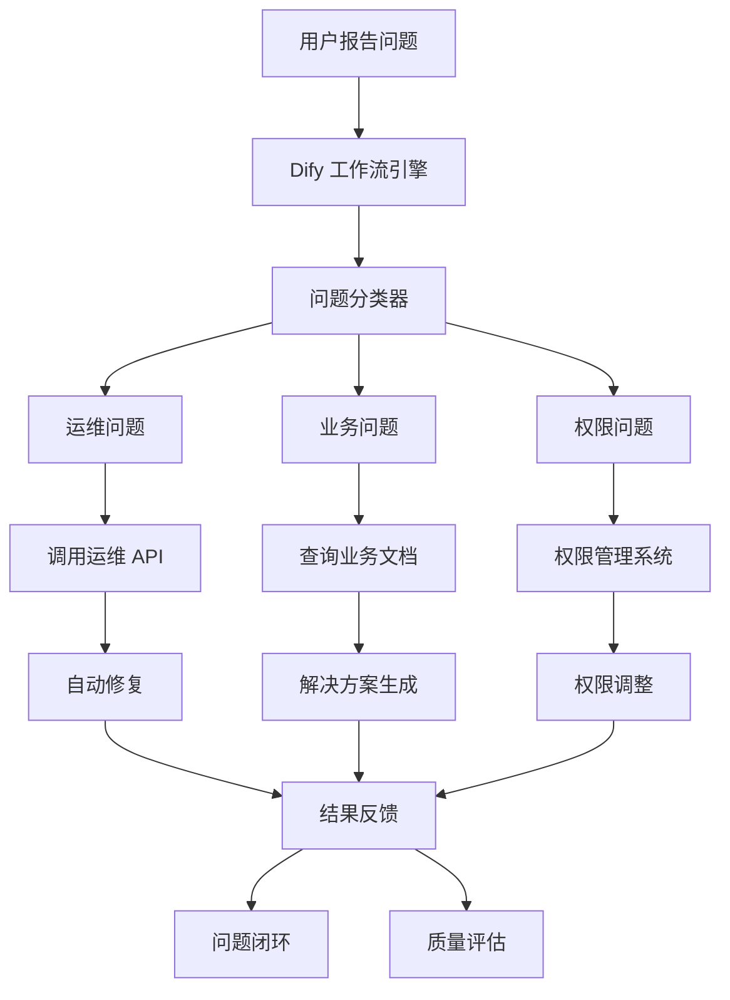

## 项目背景

随着公司业务快速发展，线上问题和用户工单数量激增，传统的人工处理方式已无法满足需求。为了实现问题的自动化处理和快速响应，我设计并实现了基于 Dify 工作流的智能问题解决系统。

## 核心架构

### 技术栈

- **工作流引擎**: Dify Workflow + Custom Nodes
- **自动化**: RAG + MCP Server 工具调用
- **AI 模型**: OpenAI GPT-4 + 业务微调模型
- **消息通信**: 企业 IM 集成（钉钉/飞书/微信）
- **API 集成**: 内部运维 API + 监控系统

### 系统架构



## 核心功能

### 🎯 智能问题分类

基于团队建立的向量库，自动识别问题类型：

- **运维类**: 服务重启、资源扩容、配置更新
- **业务类**: 数据查询、流程问题、功能异常
- **权限类**: 账号管理、权限申请、访问控制

### 🔧 自动化解决方案

```python
# Dify 工作流核心逻辑（伪代码）
class IssueResolver:
    def process_issue(self, issue_description):
        # 1. 问题理解和分类
        category = self.classify_issue(issue_description)

        # 2. 解决方案匹配
        if category == "ops":
            return self.handle_ops_issue(issue_description)
        elif category == "business":
            return self.handle_business_issue(issue_description)
        elif category == "permission":
            return self.handle_permission_issue(issue_description)

    def handle_ops_issue(self, description):
        # 解析具体操作需求
        action = self.extract_action(description)

        # 调用对应的运维 API
        if action == "restart_service":
            result = self.ops_api.restart_service(service_name)
        elif action == "scale_resource":
            result = self.ops_api.scale_resource(resource_config)

        return self.format_response(result)
```

### 🚀 API 编排系统

- **服务重启**: 自动识别服务名称并执行重启
- **资源扩容**: 根据负载情况自动调整资源配置
- **数据查询**: 连接多个数据源进行查询和分析
- **权限管理**: 自动处理常见的权限申请和分配

### 📊 实时监控与反馈

- **处理状态跟踪**: 实时监控每个工单的处理进度
- **质量评估**: 自动评估解决方案的有效性
- **学习优化**: 基于反馈持续优化工作流

## 技术亮点

### Dify 工作流设计

- **模块化节点**: 将复杂逻辑拆分为可复用的节点
- **条件分支**: 基于问题类型和复杂度的智能路由
- **异常处理**: 完善的错误处理和回退机制
- **并行处理**: 支持多个子任务并行执行

### 知识库集成

- **历史案例**: 从知识库中匹配相似的历史问题
- **解决方案库**: 维护标准化的解决方案模板
- **最佳实践**: 结合团队经验的自动化建议

## 业务价值

### 📈 效率提升

- **处理速度**: 平均响应时间从 30 分钟降至 3 分钟
- **处理容量**: 日均处理 200+ 工单，峰值处理能力显著提升
- **人力释放**: 释放 60% 的重复性工作，工程师专注核心问题

### 🎯 服务质量

- **24/7 可用**: 全天候自动处理，无人工干预
- **一致性**: 标准化的处理流程，减少人为错误
- **可追踪**: 完整的处理日志和审计跟踪

### 💰 成本节约

- **人力成本**: 减少 40% 的运维人力投入
- **响应时间**: 显著提升用户满意度
- **系统稳定性**: 快速响应减少了问题的级联影响

## 实际应用案例

### 案例 1：服务自动重启

**问题**: "生产环境 user-service 响应缓慢"
**处理流程**:

1. 识别为运维问题
2. 检查服务状态和日志
3. 自动执行服务重启
4. 验证服务恢复正常
5. 通知相关人员

**结果**: 3 分钟内完成处理，服务恢复正常

### 案例 2：数据查询自动化

**问题**: "查询用户 ID 12345 的课堂互动状态"
**处理流程**:

1. 识别为业务查询
2. 调用互动查询 API
3. 格式化查询结果
4. 返回用户友好的答案

**结果**: 秒级响应，准确返回查询结果

### 案例 3：权限批量处理

**问题**: "直播讲用户需要开通线上语音测评系统权限"
**处理流程**:

1. 识别为权限申请
2. 验证直播讲和学员
3. 自动分配线上测评权限
4. 发送权限开通通知

**结果**: 自动化处理，无需人工干预

## 技术挑战与解决

### 问题理解准确性

- **挑战**: 自然语言描述的问题可能模糊或不准确
- **解决**: 结合上下文和历史数据进行语义理解
- **效果**: 问题分类准确率达到 92%

### API 调用安全性

- **风险**: 自动化系统可能执行危险操作
- **措施**: 多层权限验证 + 操作审计 + 回滚机制
- **保障**: 建立完善的安全防护体系

### 系统集成复杂性

- **难点**: 需要集成多个内部系统和 API
- **方案**: 统一的 API Gateway + 标准化接口
- **简化**: 通过适配器模式屏蔽系统差异

---

> 🔥 这个项目展示了 AI 工作流在企业运维中的强大潜力，通过智能化的问题处理，大幅提升了运维效率和服务质量。
