## 项目背景

随着公司业务快速发展，线上问题和用户工单数量激增，传统的人工处理方式已无法满足需求。为了实现问题的自动化处理和快速响应，我设计并实现了基于 Dify 工作流的智能问题解决系统。

## 核心架构

### 技术栈

- **工作流引擎**: Dify Workflow + Custom Nodes
- **自动化**: RAG + MCP Server 工具调用
- **AI 模型**: OpenAI GPT-4 + 业务微调模型
- **消息通信**: 企业 IM 集成（钉钉/飞书/微信）
- **日志系统**: 阿里云 SLS + 前端埋点监控
- **API 集成**: 内部运维 API + 监控系统

### 系统架构

```mermaid
graph TB
    A[用户报告问题] --> B[Dify 工作流引擎]
    B --> C[问题分类器]
    C --> D[运维问题]
    C --> E[业务问题]
    C --> F[权限问题]

    D --> G[阿里云 SLS 日志查询]
    D --> H[调用运维 API]
    E --> I[前端埋点数据分析]
    E --> J[查询业务文档]
    F --> K[权限管理系统]

    G --> L[日志分析结果]
    H --> M[自动修复]
    I --> N[用户行为分析]
    J --> O[解决方案生成]
    K --> P[权限调整]

    L --> Q[智能诊断]
    M --> Q
    N --> Q
    O --> Q
    P --> Q

    Q --> R[结果反馈]
    R --> S[问题闭环]
    R --> T[质量评估]
```



## 核心功能

### 🎯 智能问题分类

基于团队建立的向量库，自动识别问题类型：

- **运维类**: 服务重启、资源扩容、配置更新
- **业务类**: 数据查询、流程问题、功能异常
- **权限类**: 账号管理、权限申请、访问控制

### 📊 数据源集成

#### 阿里云 SLS 日志系统

- **应用日志**: 服务异常、性能瓶颈、错误堆栈
- **访问日志**: API 调用、响应时间、状态码分析
- **系统日志**: 资源使用、服务状态、配置变更

#### 前端埋点监控

- **用户行为**: 页面访问、点击事件、操作路径
- **性能监控**: 页面加载时间、资源加载失败、接口响应
- **错误追踪**: JS 错误、接口异常、用户操作异常

### 🔧 自动化解决方案

```python
# Dify 工作流核心逻辑（伪代码）
class IssueResolver:
    def process_issue(self, issue_description):
        # 1. 问题理解和分类
        category = self.classify_issue(issue_description)

        # 2. 数据收集和分析
        context = self.gather_context(issue_description, category)

        # 3. 解决方案匹配
        if category == "ops":
            return self.handle_ops_issue(issue_description, context)
        elif category == "business":
            return self.handle_business_issue(issue_description, context)
        elif category == "permission":
            return self.handle_permission_issue(issue_description, context)

    def gather_context(self, description, category):
        context = {}

        if category == "ops":
            # 查询相关服务日志
            context['logs'] = self.query_aliyun_sls(description)
            # 获取系统监控数据
            context['metrics'] = self.get_system_metrics(description)

        elif category == "business":
            # 查询前端埋点数据
            context['user_behavior'] = self.query_frontend_events(description)
            # 分析用户操作路径
            context['user_journey'] = self.analyze_user_path(description)

        return context

    def query_aliyun_sls(self, description):
        """查询阿里云 SLS 日志"""
        # 提取关键信息：服务名、时间范围、错误类型
        service_name = self.extract_service_name(description)
        time_range = self.extract_time_range(description)

        # 构建 SLS 查询语句
        query = f"""
        * | where service = '{service_name}'
            and __time__ >= '{time_range.start}'
            and __time__ <= '{time_range.end}'
            and level in ('ERROR', 'WARN')
        """

        return self.sls_client.search_logs(query)

    def query_frontend_events(self, description):
        """查询前端埋点数据"""
        # 提取用户ID、页面、操作类型
        user_id = self.extract_user_id(description)
        page = self.extract_page_info(description)

        # 查询用户行为事件
        events = self.analytics_client.query_events(
            user_id=user_id,
            page=page,
            event_types=['click', 'error', 'api_call']
        )

        return events

    def handle_ops_issue(self, description, context):
        # 基于日志分析结果进行处理
        logs = context.get('logs', [])

        if self.detect_memory_leak(logs):
            return self.restart_service_with_memory_optimization()
        elif self.detect_database_connection_issue(logs):
            return self.reset_database_connections()

        # 默认处理逻辑
        action = self.extract_action(description)
        if action == "restart_service":
            result = self.ops_api.restart_service(service_name)
        elif action == "scale_resource":
            result = self.ops_api.scale_resource(resource_config)

        return self.format_response(result)
```

### 🚀 API 编排系统

- **服务重启**: 基于日志分析自动识别服务名称并执行重启
- **资源扩容**: 结合监控数据和负载情况自动调整资源配置
- **数据查询**: 整合阿里云 SLS、埋点数据等多个数据源进行查询和分析
- **权限管理**: 自动处理常见的权限申请和分配
- **故障诊断**: 通过日志模式识别和前端错误追踪进行智能诊断

### 📊 实时监控与反馈

- **处理状态跟踪**: 实时监控每个工单的处理进度
- **质量评估**: 自动评估解决方案的有效性
- **学习优化**: 基于反馈持续优化工作流

## 技术亮点

### Dify 工作流设计

- **模块化节点**: 将复杂逻辑拆分为可复用的节点
- **条件分支**: 基于问题类型和复杂度的智能路由
- **异常处理**: 完善的错误处理和回退机制
- **并行处理**: 支持多个子任务并行执行

### 知识库集成

- **历史案例**: 从知识库中匹配相似的历史问题
- **解决方案库**: 维护标准化的解决方案模板
- **最佳实践**: 结合团队经验的自动化建议

## 业务价值

### 📈 效率提升

- **处理速度**: 平均响应时间从 30 分钟降至 3 分钟
- **处理容量**: 日均处理 200+ 工单，峰值处理能力显著提升
- **人力释放**: 释放 60% 的重复性工作，工程师专注核心问题

### 🎯 服务质量

- **24/7 可用**: 全天候自动处理，无人工干预
- **一致性**: 标准化的处理流程，减少人为错误
- **可追踪**: 完整的处理日志和审计跟踪

### 💰 成本节约

- **人力成本**: 减少 40% 的运维人力投入
- **响应时间**: 显著提升用户满意度
- **系统稳定性**: 快速响应减少了问题的级联影响

## 实际应用案例

### 案例 1：服务自动重启

**问题**: "生产环境 user-service 响应缓慢"
**处理流程**:

1. 识别为运维问题
2. 查询阿里云 SLS 中 user-service 近 30 分钟的错误日志
3. 分析发现大量 "OutOfMemoryError" 和数据库连接超时
4. 基于日志模式识别为内存泄漏问题
5. 自动执行服务重启并调整 JVM 参数
6. 验证服务恢复正常，响应时间降至正常水平
7. 通知相关人员并生成问题报告

**日志分析示例**:

```
2025-04-01 14:32:15 ERROR [user-service] OutOfMemoryError: Java heap space
2025-04-01 14:32:18 ERROR [user-service] Connection timeout to database
2025-04-01 14:32:25 WARN  [user-service] High GC frequency detected
```

**结果**: 3 分钟内完成处理，服务恢复正常，并识别出根本原因

### 案例 2：前端异常诊断

**问题**: "用户反馈提交作业后页面卡死，作业状态显示异常"
**处理流程**:

1. 识别为业务问题
2. 查询前端埋点数据，定位用户操作路径
3. 分析发现用户在 "作业提交" 按钮点击后，接口调用失败
4. 查询阿里云 SLS 中对应 API 的错误日志
5. 发现数据库写入超时导致的 500 错误
6. 自动触发数据库连接池重置
7. 生成用户操作重试建议

**前端埋点数据**:

```json
{
  "user_id": "12345",
  "page": "/homework/submit",
  "events": [
    { "type": "click", "target": "#submit-btn", "timestamp": "14:30:15" },
    {
      "type": "api_call",
      "url": "/api/homework",
      "status": 500,
      "timestamp": "14:30:16"
    },
    { "type": "error", "message": "Request timeout", "timestamp": "14:30:20" }
  ]
}
```

**结果**: 2 分钟内定位问题并自动修复，用户体验显著改善

### 案例 3：权限批量处理

**问题**: "直播讲用户需要开通线上语音测评系统权限"
**处理流程**:

1. 识别为权限申请
2. 验证直播讲和学员
3. 自动分配线上测评权限
4. 发送权限开通通知

**结果**: 自动化处理，无需人工干预

## 技术挑战与解决

### 问题理解准确性

- **挑战**: 自然语言描述的问题可能模糊或不准确
- **解决**: 结合上下文和历史数据进行语义理解
- **效果**: 问题分类准确率达到 92%

### API 调用安全性

- **风险**: 自动化系统可能执行危险操作
- **措施**: 多层权限验证 + 操作审计 + 回滚机制
- **保障**: 建立完善的安全防护体系

### 系统集成复杂性

- **难点**: 需要集成多个内部系统和 API
- **方案**: 统一的 API Gateway + 标准化接口
- **简化**: 通过适配器模式屏蔽系统差异

---

> 🔥 这个项目展示了 AI 工作流在企业运维中的强大潜力，通过智能化的问题处理，大幅提升了运维效率和服务质量。
