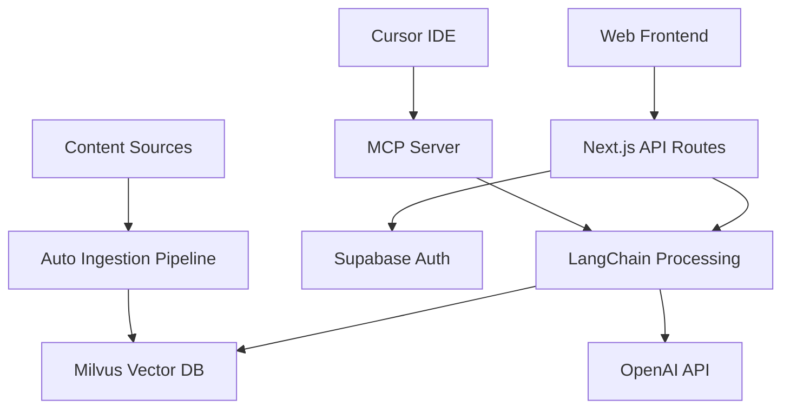

## 项目背景

为了解决团队知识散落、新人答疑效率低的问题，我设计并实现了公司首个基于向量检索的知识库平台。该平台不仅支持 Web 端查询，还创新性地提供了 MCP Server 插件，让开发者可以在 Cursor IDE 中直接检索业务文档。

## 核心架构

### 技术栈
- **前端**: Next.js 14 + TypeScript + Tailwind CSS
- **向量数据库**: Milvus + OpenAI Embeddings
- **AI 处理**: LangChain + GPT-4
- **认证**: Supabase Auth + Row Level Security
- **IDE 集成**: MCP (Model Context Protocol) Server

### 系统架构图


## 核心功能

### 🔍 智能检索
- **语义搜索**: 基于向量相似度的语义检索
- **混合检索**: 结合关键词和语义检索
- **上下文增强**: 使用 RAG 技术提供准确答案

### 📚 多源内容管理
- **Markdown 文档**: 自动解析并向量化
- **API 文档**: OpenAPI/Swagger 格式支持
- **代码片段**: 函数级别的代码检索
- **会议纪要**: 自动提取关键信息

### 🔐 权限控制
- **基于角色的访问控制**: 不同团队不同权限
- **行级安全**: Supabase RLS 确保数据隔离
- **审计日志**: 完整的查询和访问记录

### 🚀 IDE 集成
```typescript
// MCP Server 核心实现
export class KnowledgeBaseMCPServer {
  async searchKnowledge(query: string, userId: string) {
    // 1. 用户权限验证
    const hasAccess = await this.verifyAccess(userId)
    
    // 2. 向量检索
    const vectors = await this.embeddingModel.embed(query)
    const results = await this.milvusClient.search({
      collection_name: 'knowledge_base',
      vectors: [vectors],
      limit: 5
    })
    
    // 3. 重排序和过滤
    const contextDocs = await this.rerank(results, query)
    
    // 4. LLM 增强回答
    const answer = await this.llm.invoke({
      context: contextDocs,
      question: query
    })
    
    return answer
  }
}
```

## 技术亮点

### 向量化处理管道
1. **文档解析**: 支持 Markdown、PDF、Word 等格式
2. **内容分块**: 智能分段，保持语义完整性
3. **向量生成**: OpenAI text-embedding-3-large 模型
4. **存储优化**: Milvus 索引优化，支持 HNSW 算法

### MCP Server 创新
- **协议标准**: 遵循 Model Context Protocol 规范
- **IDE 集成**: 无缝集成到 Cursor、VS Code 等编辑器
- **实时查询**: 毫秒级响应，支持流式输出

### 性能优化
- **缓存策略**: Redis 缓存热门查询结果
- **连接池**: 数据库连接复用，提升并发性能
- **CDN 加速**: 静态资源 CDN 分发

## 业务价值

### 📊 数据指标
- **使用率**: 团队覆盖率 95%，日活用户 80+
- **效率提升**: 新人答疑时间从 30 分钟降至 12 分钟
- **知识沉淀**: 累计入库文档 500+ 篇，代码片段 1000+ 个
- **查询准确率**: 85% 查询能获得满意答案

### 🎯 解决的痛点
- **知识散落**: 统一的知识入口和检索
- **重复答疑**: 自助式查询，减少人工投入
- **上手门槛**: 新人快速获取业务知识
- **知识更新**: 自动同步最新文档和代码

## 技术挑战

### 向量检索精度
- **问题**: 初期检索精度不高，经常返回不相关内容
- **解决**: 引入 rerank 模型，结合业务特定的训练数据
- **效果**: 检索精度从 60% 提升至 85%

### 权限粒度控制
- **挑战**: 不同项目、不同级别的权限控制
- **方案**: 基于 Supabase RLS 的细粒度权限控制
- **实现**: 项目级、文档级、字段级多层权限

### 实时同步
- **需求**: 文档更新后实时同步到向量库
- **技术**: Webhook + 队列处理，增量更新机制
- **优化**: 只更新变更部分，减少重复计算

## 未来规划

- **多模态支持**: 图片、视频内容的向量化
- **个性化推荐**: 基于用户行为的智能推荐
- **知识图谱**: 构建实体关系图，增强检索效果
- **移动端**: 开发移动端应用，随时随地查询

---

> 💡 这个项目是我在 AI + 前端领域的重要实践，不仅解决了实际业务痛点，还在技术上实现了多项创新，特别是 MCP Server 的实现，为 IDE 集成提供了新的思路。 
