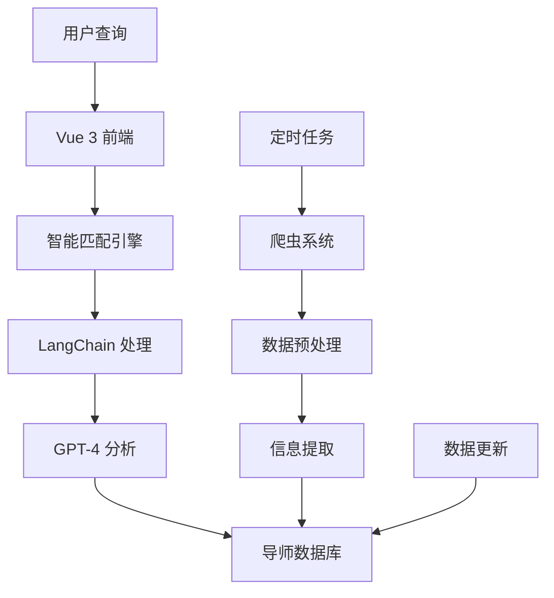

## 项目概述

海外学者智能推荐平台是一个为国内学生提供海外导师匹配服务的 Web 应用。通过自研的爬虫系统收集全球知名高校的导师信息，结合 AI 技术实现智能匹配和个性化推荐。

## 核心架构

### 技术栈

- **前端**: Vue 3 + Vite + TypeScript + Element Plus
- **后端**: Node.js + Express + MySQL
- **AI 处理**: LangChain + OpenAI GPT-4
- **数据采集**: Puppeteer + 自定义爬虫引擎
- **部署**: Docker + Nginx + PM2

### 系统架构



## 核心功能

### 🕷️ 智能数据采集

```javascript
// 爬虫核心逻辑
class UniversitySpider {
  async crawlProfessorInfo(universityUrl) {
    const browser = await puppeteer.launch({ headless: true })
    const page = await browser.newPage()

    try {
      await page.goto(universityUrl)

      // 等待页面加载
      await page.waitForSelector('.faculty-list')

      // 提取导师信息
      const professors = await page.evaluate(() => {
        return Array.from(document.querySelectorAll('.professor-item')).map(
          (item) => ({
            name: item.querySelector('.name')?.textContent,
            title: item.querySelector('.title')?.textContent,
            department: item.querySelector('.department')?.textContent,
            research: item.querySelector('.research')?.textContent,
            email: item.querySelector('.email')?.textContent,
            homepage: item.querySelector('.homepage')?.href,
          })
        )
      })

      // 详细信息抓取
      for (let prof of professors) {
        if (prof.homepage) {
          prof.details = await this.crawlProfessorDetails(prof.homepage)
        }
      }

      return professors
    } finally {
      await browser.close()
    }
  }

  async crawlProfessorDetails(profileUrl) {
    // 抓取详细的研究方向、发表论文、项目经历等
    // ...
  }
}
```

### 🤖 智能匹配系统

```typescript
// 智能匹配服务
export class ProfessorMatchingService {
  async matchProfessors(userQuery: UserQuery) {
    // 1. 用户需求分析
    const requirements = await this.parseUserRequirements(userQuery)

    // 2. 向量化查询条件
    const queryVector = await this.vectorizeQuery(requirements)

    // 3. 数据库检索
    const candidates = await this.searchCandidates(queryVector)

    // 4. LLM 增强匹配
    const matches = await this.llmEnhancedMatching(requirements, candidates)

    // 5. 结果排序和过滤
    return this.rankAndFilter(matches, userQuery.preferences)
  }

  private async parseUserRequirements(query: UserQuery) {
    const prompt = `
分析以下用户查询，提取关键信息：
- 研究领域：${query.researchField}
- 目标学位：${query.targetDegree}
- 地区偏好：${query.region}
- 其他要求：${query.otherRequirements}

请提取：研究关键词、学术要求、地理位置、导师特质等维度。
`

    return await this.llm.invoke(prompt)
  }
}
```

### 📊 多维度推荐

- **研究领域匹配**: 基于关键词和语义相似度
- **学术背景**: 导师声誉、发表记录、获奖情况
- **地理位置**: 国家、城市、校园环境
- **个人偏好**: 导师风格、实验室规模、资助情况

### 🔍 高级搜索功能

- **智能搜索**: 自然语言查询支持
- **多条件筛选**: 学校排名、研究方向、招生状态
- **相似推荐**: 基于已选导师推荐相似候选人
- **收藏管理**: 个人导师收藏和对比功能

## 技术亮点

### 数据采集优化

- **数据清洗**: 去重、格式标准化、信息补全
- **增量更新**: 只爬取变更内容，提高效率
- **容错机制**: 网络异常重试、数据验证

### AI 增强匹配

```python
# 匹配算法核心逻辑
class SmartMatcher:
    def calculate_match_score(self, user_profile, professor_profile):
        scores = {}

        # 1. 研究领域相似度
        research_similarity = self.calculate_research_similarity(
            user_profile.research_interests,
            professor_profile.research_areas
        )
        scores['research'] = research_similarity * 0.4

        # 2. 学术水平匹配度
        academic_match = self.calculate_academic_fit(
            user_profile.academic_background,
            professor_profile.requirements
        )
        scores['academic'] = academic_match * 0.3

        # 3. 地理位置偏好
        location_score = self.calculate_location_preference(
            user_profile.preferred_locations,
            professor_profile.university.location
        )
        scores['location'] = location_score * 0.2

        # 4. 其他因素
        other_factors = self.calculate_other_factors(user_profile, professor_profile)
        scores['others'] = other_factors * 0.1

        return sum(scores.values())
```

### 前端优化

- **虚拟滚动**: 处理大量导师数据的展示
- **懒加载**: 图片和详细信息按需加载
- **缓存策略**: 用户搜索结果缓存
- **响应式设计**: 移动端适配

## 数据规模与质量

### 数据覆盖

- **高校数量**: 覆盖全球 200+ 知名高校
- **导师信息**: 50,000+ 导师详细档案
- **研究领域**: 覆盖 STEM、人文、社科等各领域
- **更新频率**: 每月全量更新，重要信息实时更新

### 数据质量

- **信息完整度**: 95% 导师包含基本信息，80% 包含详细研究方向
- **准确性**: 人工抽检准确率 > 92%
- **时效性**: 90% 信息为近一年内数据

## 用户体验设计

### 搜索体验

```vue
<!-- 智能搜索组件 -->
<template>
  <div class="smart-search">
    <el-input
      v-model="searchQuery"
      placeholder="例如：机器学习方向的美国导师，偏向计算机视觉..."
      @input="handleSearch"
      :loading="searching"
    >
      <template #prefix>
        <el-icon><Search /></el-icon>
      </template>
    </el-input>

    <!-- 搜索建议 -->
    <div class="search-suggestions" v-if="suggestions.length">
      <div
        v-for="suggestion in suggestions"
        :key="suggestion.id"
        @click="selectSuggestion(suggestion)"
        class="suggestion-item"
      >
        {{ suggestion.text }}
      </div>
    </div>
  </div>
</template>
```

### 结果展示

- **卡片式布局**: 导师信息一目了然
- **交互式筛选**: 实时筛选结果
- **对比功能**: 多个导师并排对比
- **详情页**: 完整的导师档案展示

## 业务价值

### 🎯 用户价值

- **效率提升**: 传统搜索需要数小时，平台 5 分钟完成初筛
- **信息整合**: 一站式获取全球导师信息
- **智能推荐**: AI 推荐准确率比关键词搜索提升 2 倍
- **决策支持**: 多维度对比帮助用户做出明智选择

## 技术挑战与解决

### 大规模数据处理

- **挑战**: 50 万条导师信息的存储和检索
- **解决**: 数据库索引优化 + 分页查询
- **效果**: 查询响应时间 < 200ms

### 反爬虫应对

- **问题**: 部分高校网站有严格的反爬虫机制
- **策略**: 多 IP 代理池 + 模拟真实用户行为 + 分布式爬取
- **成果**: 成功率保持在 85% 以上

### 数据质量保证

- **难点**: 网站结构差异导致的数据提取错误
- **方案**: 通用模板 + 站点特定规则 + 人工校验
- **改进**: 建立数据质量监控和自动修正机制

---

> 🌍 这个项目是我在 AI + 教育领域的早期实践，通过技术手段解决信息不对称问题，为用户创造实际价值。项目展示了我在全栈开发、数据处理和 AI 应用方面的综合能力。
