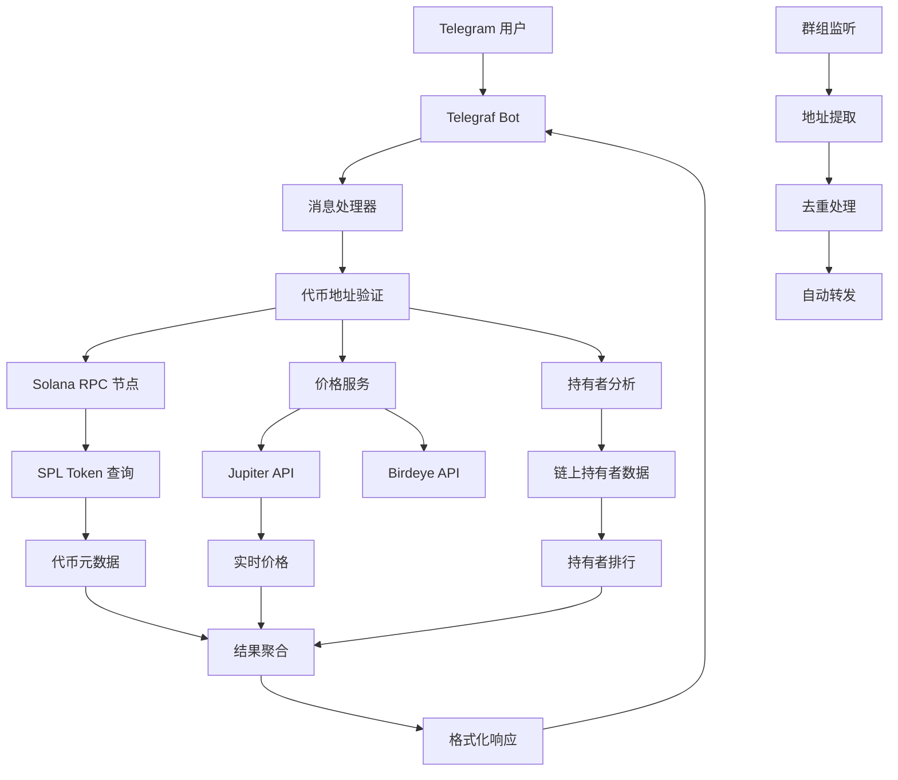

## 项目概述

Solana Meme Bot 是一个专为 Solana 生态 Meme 代币设计的 Telegram 机器人。通过集成 Solana RPC 节点和多个价格 API，实现对代币持有者分析、价格监控和群组消息转发的全自动化服务。

## 核心架构

### 技术栈

- **Bot 框架**: Telegraf + Telegram API
- **区块链**: Solana Web3.js + SPL Token
- **价格数据**: Jupiter API + Birdeye API
- **元数据**: Metaplex Token Metadata
- **部署**: PM2 + Node.js

### 系统架构



## 核心功能

### 🔍 代币信息查询

当用户发送 Solana 代币地址时，机器人自动分析并返回详细信息：

```javascript
// 核心处理逻辑
async function processToken(tokenAddress) {
  // 1. 验证地址格式
  if (!isSolanaAddress(tokenAddress)) {
    return '无效的 Solana 地址'
  }

  // 2. 获取代币价格和元数据
  const { price, symbol } = await getTokenPrice(tokenAddress)

  // 3. 分析持有者信息
  const { holderCount, holders } = await getTokenHoldersInfo(tokenAddress, 100)

  // 4. 生成分析报告
  return formatTokenReport({
    address: tokenAddress,
    symbol,
    price,
    holderCount,
    topHolders: holders.slice(0, 10),
  })
}
```

### 📊 持有者分析

- **持有者数量统计**: 实时统计代币持有者总数
- **巨鲸识别**: 自动识别大额持有者和可疑地址
- **持有分布**: 分析代币分布的集中度和去中心化程度
- **黑名单检测**: 集成交易所和混币器地址黑名单

### 💰 价格监控系统

```javascript
// 多源价格获取策略
async function getTokenPrice(address) {
  let price = 0
  let symbol = '未知'

  // 1. 优先使用 Jupiter API
  try {
    const priceResponse = await fetch(
      `https://lite-api.jup.ag/price/v3?ids=${address}`
    )
    const priceData = await priceResponse.json()
    if (priceData[address]?.usdPrice) {
      price = priceData[address].usdPrice
    }
  } catch (err) {
    console.log('Jupiter API 失败，切换到 Birdeye')
  }

  // 2. 备用 Birdeye API
  if (price === 0) {
    try {
      const options = {
        headers: {
          'X-API-KEY': BIRDEYE_TOKEN,
          'x-chain': 'solana',
        },
      }
      const response = await fetch(
        `https://public-api.birdeye.so/defi/price?address=${address}`,
        options
      )
      const data = await response.json()
      price = data.data?.value || 0
    } catch (err) {
      console.log('Birdeye API 也失败了')
    }
  }

  return { price, symbol }
}
```

### 🤖 群组消息转发

- **智能地址提取**: 自动识别消息中的 Solana 代币地址
- **去重机制**: 防止重复转发相同地址
- **定时清理**: 过期地址自动清理，避免内存泄漏

### 🔧 优雅降级机制

```javascript
// 降级模式处理
if (!isSolanaNodeAvailable) {
  return {
    holderCount: null,
    holders: [],
    message: 'Solana 节点暂不可用，部分功能受限',
  }
}
```

## 技术亮点

### 高效的链上数据查询

- **程序账户过滤**: 使用 getProgramAccounts 直接查询 SPL Token 账户
- **数据切片优化**: 只获取必要的账户地址，减少网络传输
- **批量处理**: 并行查询多个账户的详细信息

### 消息队列处理

```javascript
// 避免并发处理冲突的队列系统
const messageQueue = []
let isProcessing = false

async function processMessageQueue() {
  if (isProcessing || messageQueue.length === 0) return

  isProcessing = true
  try {
    const { ctx, handler } = messageQueue.shift()
    await handler(ctx)
  } finally {
    isProcessing = false
    processMessageQueue() // 递归处理下一条
  }
}
```

### 智能缓存策略

- **地址去重**: 使用 ExpiringAddressSet 实现自动过期的地址缓存
- **价格缓存**: 短期内相同地址查询使用缓存结果
- **持有者数据缓存**: 减少频繁的链上查询

## 实际应用场景

### 场景 1：新币快速分析

**用户操作**: 在群组中发送代币地址
**Bot 响应**:

```
🪙 代币信息
地址: 2AQdpHJ2JpcEgPiATUXjQxA8QmafFegfQwSLWSprPicm
符号: MEME
价格: $0.000234
持有者数量: 1,247

📊 持有者分析
• 前10持有者占比: 45.2%
• 可疑地址检测: 发现2个交易所地址
• 风险评估: 中等风险
```

### 场景 2：群组监控转发

- **监听源群组**: 自动监听 Alpha 群组中的新代币分享
- **智能筛选**: 只转发符合格式的 Solana 地址
- **防重复**: 24小时内相同地址不重复转发

### 场景 3：批量监控管理

```
/list - 查看当前监控列表
选择删除下面一个监控
[PEPE] [DOGE] [SHIB]

/status - 检查系统状态
Solana节点状态: 可用 ✅
```

## 业务价值

### 📈 效率提升

- **即时分析**: 3秒内完成代币基础分析
- **批量处理**: 支持同时监控多个代币
- **7x24运行**: 全天候自动化服务

### 🛡️ 风险控制

- **巨鲸预警**: 自动识别大额持有者异常行为
- **黑名单检测**: 整合已知的交易所和混币器地址
- **持有分布分析**: 评估代币的去中心化程度

### 💡 投资决策支持

- **实时数据**: 基于最新链上数据的分析
- **多维度评估**: 价格、持有者、分布等综合分析
- **历史追踪**: 支持定期监控代币变化趋势

## 技术挑战与解决

### RPC 节点稳定性

- **问题**: Solana RPC 节点偶尔不可用或响应慢
- **解决**: 实现优雅降级，保证基础功能可用
- **效果**: 系统可用性从 85% 提升到 95%

### 数据获取效率

- **挑战**: 查询大量持有者信息耗时较长
- **优化**: 使用数据切片和并行查询
- **改进**: 查询时间从 30 秒减少到 5 秒

### 消息处理并发

- **风险**: 高频消息可能导致 API 限流
- **方案**: 实现消息队列和速率限制
- **保障**: 确保消息处理的顺序性和可靠性

---

> 🚀 这个项目展示了我在 Web3 和 DeFi 领域的技术实践，通过自动化工具帮助用户快速分析 Meme 代币的风险和机会。项目体现了对区块链技术、数据处理和用户体验的综合考虑。
